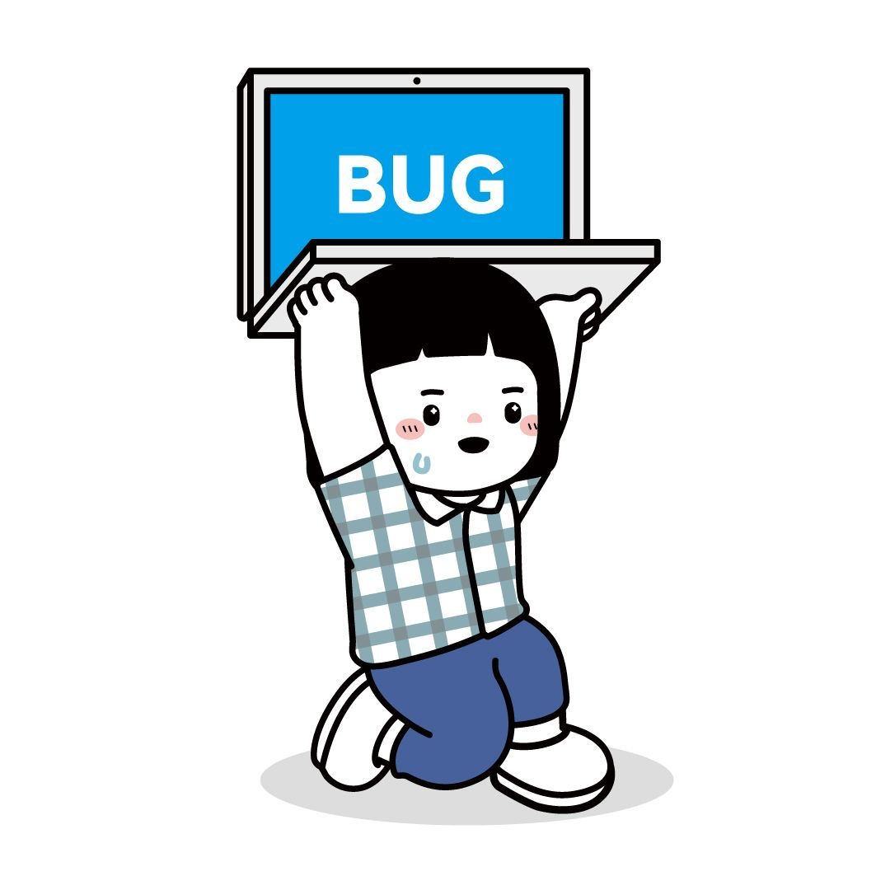

<!--  -->

<!--  -->

### Hello World 👋

- 🤍 I am currently a Stat Ph.D. at Peking University. My research interest is in *nonparametrics* and *mislabeling*.
 - 📫 How to reach me **helenology@163.com**
- 🎀 Coding languanges: `python` and `R`.
  - 🏓 Everyday I just write bugs and then fix them.

